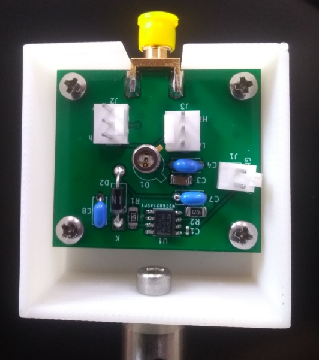

# Fast-Photodetector
Kicad design of high speed photodetector (~200 MHz) that is based on OPA 857 Transimpedance circuit. 
## Few notes:
- Circuit is designed and tested with Hamamatsu [Hamamatsu S5972](https://www.hamamatsu.com/eu/en/product/type/S5972/index.html) photodiodes  but maybe used with other photodiodes with similar or larger capacitance (note that the bandwidth may be photodiode limited in this case). 
- Circuit is supplied by external 9-15V voltage via pin connectors. 
- The datasheet of OPA 857 suggests installing shunting capacitance in parallel with R3 with a capacitance of 0.1 pF. 
However the experiment did not show the much performance difference in the presence of the capacitance.
- The first version of the photodetector is depicted below.

Some changes were introduced in the current version:
- Through hole capacitors are replaced SMD components.
- All passive SMD components are replaced with 1206 case for convenience
- 0.1 pF capacitance is removed.
